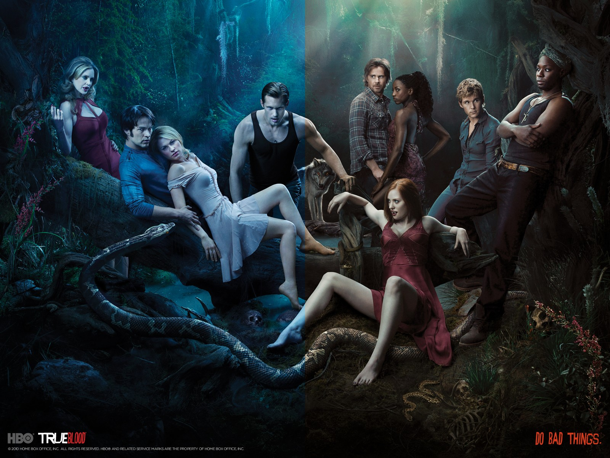
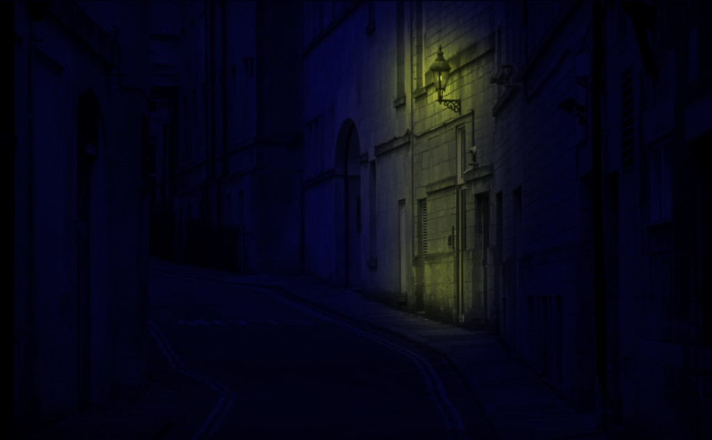
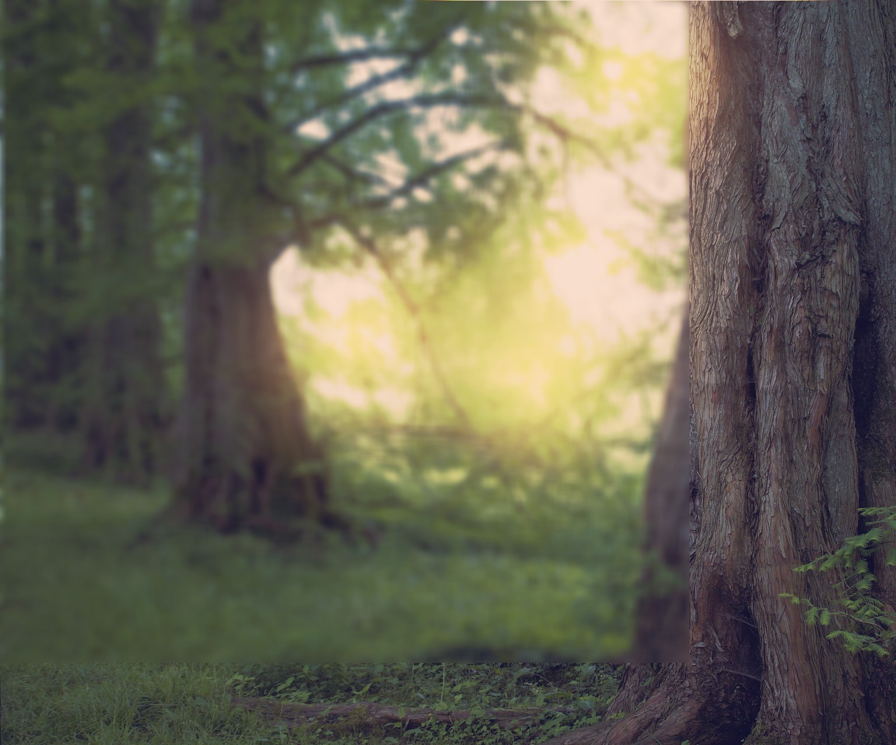

# imageprocessor
Process images in a batch way. Implement various filter for multiple image and video processing.

## Examples

### Temperature Manipulation

Inspired by photodemon software:
  http://www.tannerhelland.com/4435/convert-temperature-rgb-algorithm-code/

Code:
```c
  /**
   * Read the "True Blood" image.
   */
  layer_t true_blood = read_JPEG_file(argv[1]);
  rect_t adjustment_zone = {true_blood.width>>1, 0, true_blood.width, true_blood.height};
  layer_info(true_blood);

  /**
   * Prepare layers and setup masks.
   */
  layer_t true_blood_adjustment_layer = layer_copy(true_blood);
 

  /**
   * Adjust temperature in adjustment layer.
   */
  kelvin_temperature(true_blood_adjustment_layer, 1600.0f, 0.58f, 0.9999f, adjustment_zone);
  write_JPEG_file("true_blood_adjustment_layer.jpg", true_blood_adjustment_layer, 90);

  /**
   * Setup opacity of adjustment layer and merge down.
   */
  true_blood_adjustment_layer.opacity = 0.5f;
  true_blood_adjustment_layer.blend_func = blend_normal;
  layer_t layers[2] =  { true_blood, true_blood_adjustment_layer};
  layer_t output = layer_merge_down( 2, layers );
  write_JPEG_file("final_true_blood_poster.jpg", output, 90);


```



### Day to Night 

Inspired by this youtube PS tutorial:
    https://www.youtube.com/watch?v=HXZOKqDbgpY

Code:
```c
  /**
   * Read the street daylight image.
   */
  layer_t street = read_JPEG_file(argv[1]);
  layer_info(street);

  /**
   * Prepare layers and setup masks.
   */
  layer_t street_night = layer_copy(street);
  layer_t street_lights = layer_copy(street);
  layer_t street_lights_mask = layer_new_dim(street.width, street.height, street.color_components, False, False);
  //street_lights.mask = street_lights_mask.image;
 

  /**
   * Convert daily image into night image.
   */
  colorize(street_night, vec3_init(0.0f, 0.0f, COLOR_MAX), 0.8f, 0.0f, ALL_LEVELS, False, street.zone);
  exposure(street_night, -1.9f, street.zone);
  write_JPEG_file("night.jpg", street_night, 90);

  /**
   * Convert daily image into night lamp light, enhance clarity with unsharp mask.
   */
  colorize(street_lights, vec3_init(COLOR_MAX, COLOR_MAX, 0.0f), 0.8f, 0.0f, ALL_LEVELS, False, street.zone);

  float cyan_red[3] = { 0.0f, 0.0f, 0.03f };
  float magenta_green[3] = { 0.05f, 0.08f, 0.07f };
  float yellow_blue[3] = { -0.3f, -0.3f, -0.3f };
  adjust_color_balance(street_lights, cyan_red, magenta_green, yellow_blue, street_lights.zone);

  unsharp(street_lights, 20, 1.05, street_lights.zone);
  write_JPEG_file("lights.jpg", street_lights, 90);
  
  /**
   * Create mask for night light image.
   */
  brush_touch(street_lights_mask, IMAGE, 400, 0.67f, 633, 114, vec3_init(1.0f, 1.0f, 1.0f), blend_normal);
  brush_touch(street_lights_mask, IMAGE, 600, 0.27f, 633, 220, vec3_init(1.0f, 1.0f, 1.0f), blend_normal);
  brush_touch(street_lights_mask, IMAGE, 400, 0.27f, 633, 304, vec3_init(1.0f, 1.0f, 1.0f), blend_normal);
  brush_touch(street_lights_mask, IMAGE, 400, 0.47f, 633, 404, vec3_init(1.0f, 1.0f, 1.0f), blend_normal);
  write_JPEG_file("lights_mask.jpg", street_lights_mask, 90);

  /**
   * Set up lights mask ans merge-down.
   */
  street_lights.mask = street_lights_mask.image;
  //street_lights.blend_func = blend_lighten_only;
  street_lights.blend_func = blend_linear_light;
  layer_t layers[2] =  { street_night, street_lights };
  layer_t output = layer_merge_down( 2, layers );
  write_JPEG_file("final_street.jpg", output, 90);


```



### Fantasy Forest

Inspired by this youtube PS tutorial: 
    https://www.youtube.com/watch?v=34pTcSH06HA

Code:
```c
  layer_t sequoia_trees = read_JPEG_file(argv[1]);
  rect_t crop_zone = {0, 0, sequoia_trees.width*0.8, sequoia_trees.height};
  layer_info(sequoia_trees);
  flipX(sequoia_trees);
  crop(&sequoia_trees, crop_zone);
  int w = sequoia_trees.width;
  int h = sequoia_trees.height;
  rect_t blur_zone = {0, 0, 0.77f*w, 0.89f*h};
  gauss(sequoia_trees, 20, 0.0f, blur_zone);
  vec3 fantasy_orange = vec3_init(1.0f, 156.0f/255.0f, 97.0f/255.0f);
  brush_touch(sequoia_trees, IMAGE, 1000, 1.0f, 0.7f*w, 0.1f*h, fantasy_orange, blend_linear_light);
  brush_touch(sequoia_trees, IMAGE, 1000, 1.0f, 0.4f*w, 0.45f*h, fantasy_orange, blend_linear_light);
  brush_touch(sequoia_trees, IMAGE, 1000, 1.0f, 0.6f*w, 0.5f*h, fantasy_orange, blend_linear_light);
  brush_touch(sequoia_trees, IMAGE, 1000, 1.0f, 0.65f*w, 0.35f*h, fantasy_orange, blend_linear_light);
  gradient_map(sequoia_trees, vec3_init(0.26f, 0.1f, 0.47f), vec3_init(1.0f, 0.67f, 0.05f), 0.5f/*weight*/, 0.22f /*opacity*/, sequoia_trees.zone);
 
  float cyan_red[3] = { 0.0f, -0.22f, -0.03f };
  float magenta_green[3] = { 0.05f, -0.08f, -0.07f };
  float yellow_blue[3] = { 0.09f, 0.07f, 0.02f };
  adjust_color_balance(sequoia_trees, cyan_red, magenta_green, yellow_blue, sequoia_trees.zone);
  layer_info(sequoia_trees);

  write_JPEG_file("output.jpg", sequoia_trees, 90);

```




### Recolor and Desaturate Example

```c
  /**
   * Read the red car image.
   */
  layer_t red_car = read_JPEG_file(argv[1]);
  layer_info(red_car);

  rect_t adjust_zone = { red_car.width >> 1, 0, red_car.width, red_car.height };


  /**
   * Adjust saturation of all colors except red.
   */
  adjust_color_saturation(
     red_car, 
     0.0f, -1.0f, -1.0f, -1.0f, 0.0f, -1.0f, /* hue saturation */
     0.0f, 0.0f, 0.0f, 0.0f, 0.0f, 0.0f,  /* lightness */
     adjust_zone);

  /**
   * Take red color and shift it to yellow.
   */
  replace_color(
    red_car,
    0.1666f,
    0.0f, 
    0.0f, 
    0.0f,
    0.0f,
    0.0f,
    adjust_zone
  );


  write_JPEG_file("red-car.jpg", red_car, 90);

```


## Vectorscope Diagram

```c
     layer_t vectorscope_layer = layer_new_dim(400, 400, layer.color_components, False, False);
     vectorscope_t out;
     int max_H, max_S;
     vectorscope(layer,  out, &max_H, &max_S, layer.zone);
     draw_vectorscope(vectorscope_layer, out);
     write_JPEG_file("vectorscope.jpg", vectorscope_layer, 90);

```

